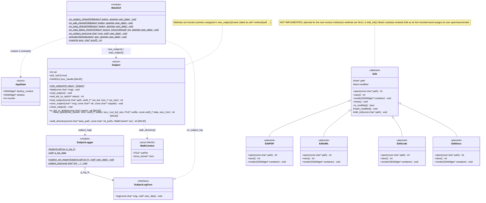

# Class diagram

Status: draft for user approval; version 0.0.15.

> [!WARNING]
> **The `Edit` class and its subclasses (`EditPDF`, `EditUML`, `EditCode`,
> `EditDocs`) are not implemented.** They are a design proposal for the next
> version and do not exist in `src/` or `include/` yet. Everything else in this
> diagram reflects the current code.

StudyStudio is written in C, so it has no real classes. This diagram models the
object-oriented patterns the code already uses: `struct Subject` with methods as
function pointers (assigned in `new_subject()`, called as `self->method(self, ...)`),
`new_subject()` / `close_subject()` as constructor and destructor, and
`SubjectLogFunc` as an abstract interface that decouples `subject.c` from GTK.



## Reading the diagram

- `<<module>>` marks a source file that groups `static` functions and globals
  (`src/main.c`, `src/subject.c`) rather than a struct.
- `<<planned>>` marks a class that is not implemented yet (see the warning at
  the top). `Edit` keeps its `<<abstract>>` label and carries the same warning
  in its note.
- `[Win32]` / `[Linux]` members only exist under the matching `#ifdef _WIN32`
  branch of `include/subject.h`.
- `$` (underlined when rendered) marks `static` functions and globals.
- `*` after the parentheses (italic when rendered) marks abstract methods: in C
  they are function pointers that the base initializer leaves `NULL` and each
  subclass must assign.
- `#` marks protected members: meant to be used by the `Edit` subclasses, not by
  the rest of the application.
- Pointer types are written as in C (`GtkWidget*`, `uint8_t**`).
- Private helpers in `src/subject.c` that are not exposed through `Subject`
  (for example `_unpack_tar_buffer`, `_derive_extract_dir`) are omitted.

## Relationships

| From | To | Meaning |
| --- | --- | --- |
| `MainGUI` | `AppState` | `activate()` allocates the state and passes it as `user_data` to the callbacks. |
| `MainGUI` | `Subject` | `on_load_dialog_finish()` creates a `Subject` and calls `load_subject()`. |
| `MainGUI` | `SubjectLogFunc` | `on_subject_log()` is the concrete implementation that writes to the footer label. |
| `SubjectLogger` | `SubjectLogFunc` | Stores the registered callback in `g_log_fn` via `subject_set_logger()`. |
| `Subject` | `SubjectLogger` | Reports status and errors through `subject_log()`. |
| `Subject` | `WalkContext` | Windows `walk_directory()` uses it to carry the output file and LZMA stream. |
| `EditPDF`, `EditUML`, `EditCode`, `EditDocs` | `Edit` | **Planned, not implemented.** Inheritance: each subclass embeds `Edit` as its first member, reuses the common operations (`close`, `is_modified`, `mark_modified`, `edit_init`) and implements the abstract ones (`open`, `save`, `render`). |

## `Edit` hierarchy (proposed, not yet implemented)

> [!WARNING]
> Pending for the next version. None of the code below exists in the project
> yet; it is a sketch of the intended design and may change when it is
> implemented.

`Edit` is an abstract base for the editors. It holds the state and operations
shared by every editor, while each subclass supplies the behavior that depends
on the file type. In C this follows the same pattern as `Subject`:

```c
typedef struct Edit Edit;
struct Edit {
    char *path;
    bool modified;

    /* abstract: assigned by each subclass */
    int  (*open)(Edit *self, const char *path);
    int  (*save)(Edit *self);
    void (*render)(Edit *self, GtkWidget *container);

    /* common: implemented once in edit.c */
    void (*close)(Edit *self);
    bool (*is_modified)(Edit *self);
};

typedef struct {
    Edit base;          /* must be the first member */
    /* PDF-specific fields */
} EditPDF;
```

Because `base` is the first member, an `EditPDF *` can be safely cast to
`Edit *`, so the rest of the application can work with any editor through the
`Edit` interface (Liskov substitution).
